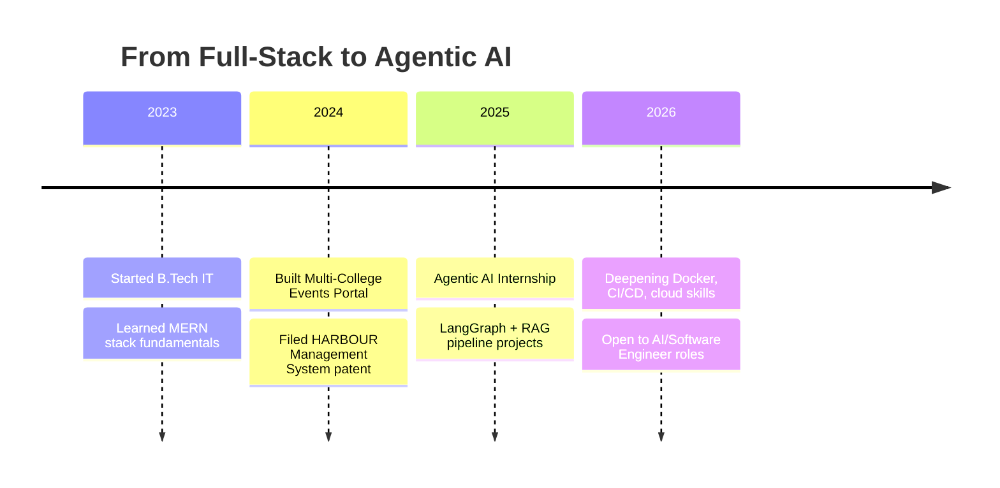

<h1 align="center">Hi 👋, I'm Siva</h1>
<h3 align="center">AI Engineer | Full-Stack Developer | Building Agentic AI Systems & RAG Pipelines</h3>

<p align="center">
  
</p>

<p align="center">
  <a href="https://www.linkedin.com/in/sivasurya-tech/">
    
  </a>
  <a href="mailto:sivatechie17@gmail.com">
    
  </a>
  <a href="https://portfolio-v2-inky-ten.vercel.app">
    
  </a>
  <a href="https://leetcode.com/u/Siva_2517/">
    
  </a>
  <a href="https://github.com/Siva-2517/PortfolioV2/blob/main/public/resume/Sivasurya_AI_Engineer_Resume.pdf">
    
  </a>
</p>

<p align="center">
  
</p>

---

### 🧠 About Me

```yaml
name: Siva
role: AI Engineer & Full-Stack Developer
education: B.Tech Information Technology, Sri Shakthi Institute of Engineering and Technology
cgpa: 8.23
graduation: 2027
focus: Agentic AI, RAG Pipelines, LangGraph, Full-Stack Development
patent: HARBOUR Management System
currently: Open to Software Engineer / AI Engineer roles
```

- 🔭 Currently building an end-to-end **agentic AI / RAG** project portfolio
- 🧩 Completed an **Agentic AI Internship** building LangGraph workflows & RAG pipelines
- 📜 Hold a **published patent** — HARBOUR Management System ([view patent →](YOUR_PATENT_LINK))
- 🌱 Closing skill gaps in **Docker, CI/CD, SQL, and cloud platforms**
- ⚡ Fun fact: I once debugged a race condition at 3 AM fueled by nothing but chai and stubbornness

---

### 🗺️ My Journey



---

### 🛠️ Tech Stack

<p align="center">
  
</p>

<p align="center">
  
  
  
  
  
  
  
</p>

---

### 🚀 Featured Projects

<table>
  <tr>
    <td width="50%">
      <h4>🤖 <a href="https://github.com/Siva-2517/rag-customer-support">RAG Customer Support Assistant</a></h4>
      <p>Agentic retrieval-augmented generation system built with LangGraph, ChromaDB, and HuggingFace embeddings for context-aware support automation.</p>
      
      
      
    </td>
    <td width="50%">
      <h4>🖐️ <a href="https://github.com/Siva-2517/hand-gesture-cursor">Hand Gesture Cursor Control</a></h4>
      <p>Real-time computer vision system using OpenCV and MediaPipe to control the cursor through hand gestures.</p>
      
      
      
    </td>
  </tr>
  <tr>
    <td width="50%">
      <h4>🏗️ <a href="YOUR_PATENT_LINK">HARBOUR Management System (Patented)</a></h4>
      <p>Patented management system project — published technical innovation.</p>
      
      
    </td>
    <td width="50%">
      <h4>🌐 <a href="https://github.com/Siva-2517/multi-college-events">Multi-College Events Portal</a></h4>
      <p>Full-stack MERN application enabling event management and collaboration across multiple colleges.</p>
      
      
      
      
    </td>
  </tr>
</table>

---

### 📊 GitHub Stats

<p align="center">
  
  
</p>

<p align="center">
  
</p>

<p align="center">
  
</p>

---

### 🏆 GitHub Trophies

<p align="center">
  
</p>

---

### 🤝 Connect With Me

<p align="center">
  Open to <b>Software Engineer</b>, <b>Full Stack Developer</b>, and <b>AI Engineer</b> roles.<br/>
  Always happy to talk about agentic AI, RAG systems, or full-stack architecture.
</p>

<p align="center">
  <a href="https://www.linkedin.com/in/sivasurya-tech/"></a>
  <a href="mailto:sivatechie17@gmail.com"></a>
</p>

<p align="center">
  
</p>
